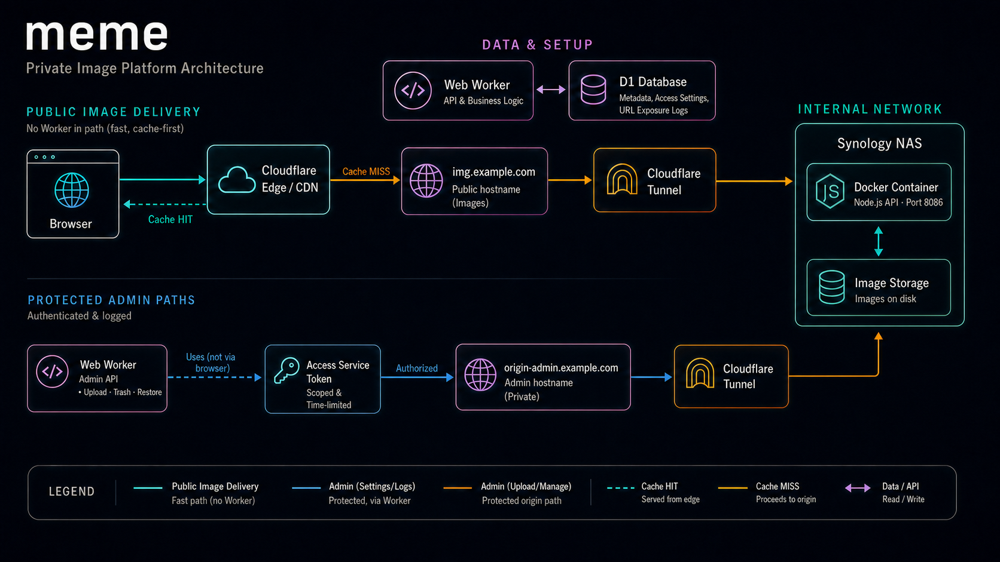
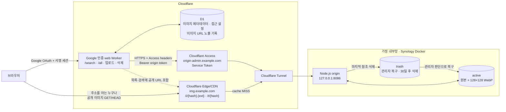
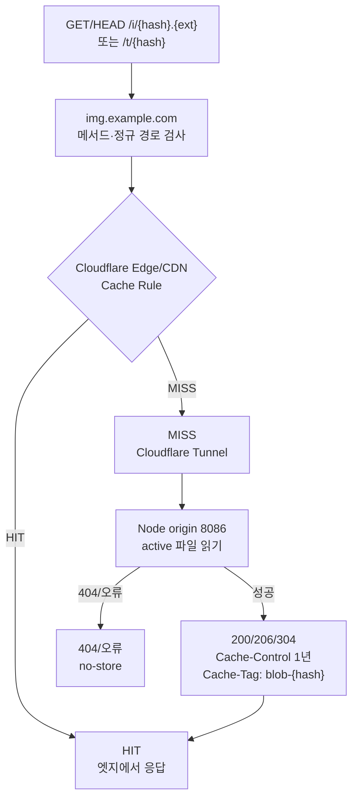
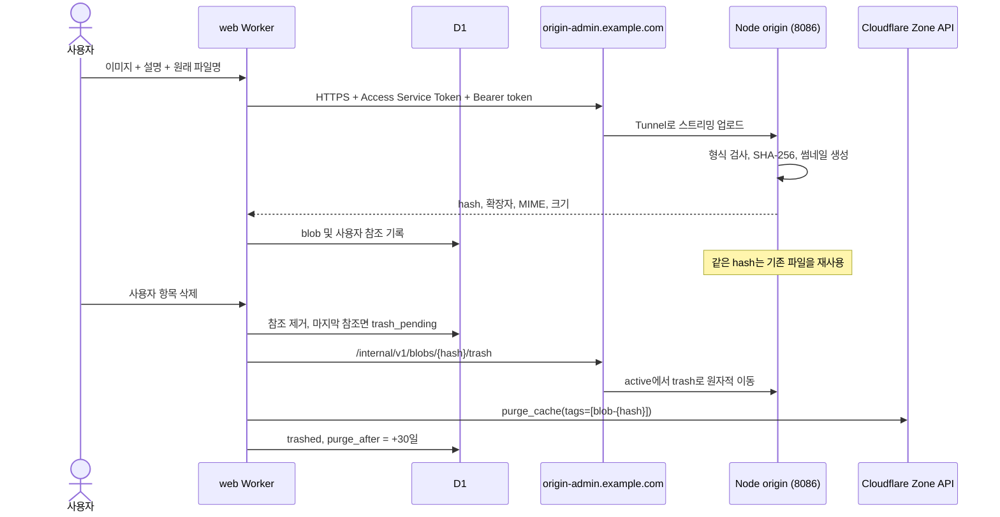
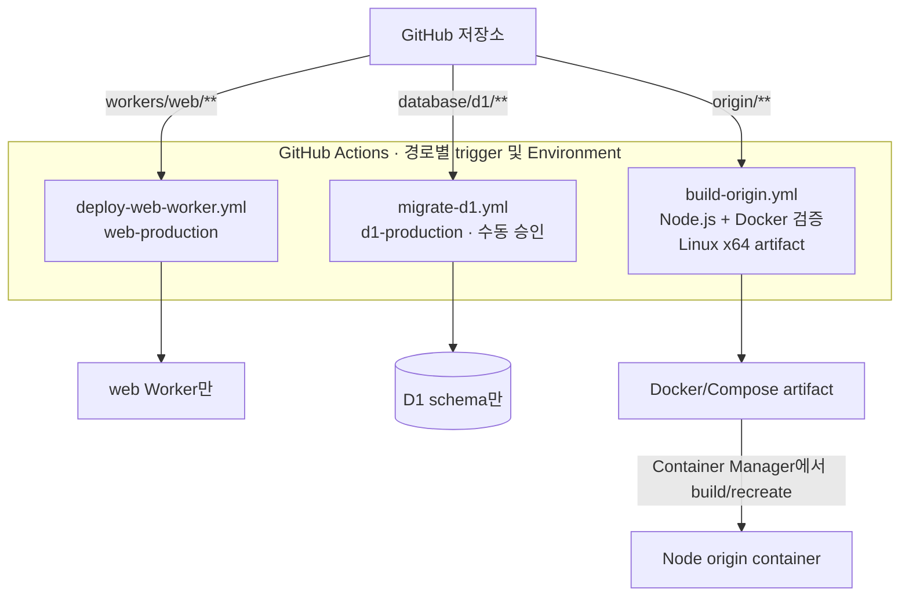

# 서비스 및 장비 연결 구조

현재 구성은 공개 이미지 경로와 관리 경로를 분리합니다. 공개 이미지는 별도 이미지
Worker 없이 Cloudflare CDN과 Tunnel을 통해 Node origin으로 직접 전달합니다. 실제
계정 ID, 도메인, 데이터베이스 ID, 토큰은 저장소에 기록하지 않습니다.

## Presentation overview

## 전체 구조

`web Worker`는 Google OpenID Connect 로그인을 요구합니다. 관리자 이메일 하나와
D1의 회원 허용 설정으로 접근을 제어하며, 관리자 경로와 노출 기록은 관리자에게만
노출합니다. `/all`과 `/search`는 현재 사용자의 항목만 조회하고, 해시 URL을 직접
아는 사용자의 공개 이미지 GET/HEAD는 `img.example.com`에서 처리합니다.

`img.example.com`은 이미지 경로만 공개하고 Cache Rule로 정상 응답을 1년 캐시합니다.
`origin-admin.example.com`은 Access Service Auth 정책으로 web Worker의 service
token만 허용합니다. origin은 Access 헤더와 별도로 Bearer mutation token을 검증하며,
두 호스트 모두 같은 Tunnel connector를 통해 내부 Node.js origin에 도달합니다.

## 이미지 조회와 엣지 캐시

캐시 HIT이면 Tunnel과 Synology에 요청이 발생하지 않습니다. 공개 이미지 응답은
`Cache-Control: public, max-age=31536000, immutable`과 `Cache-Tag: blob-{sha256}`를
반환하고, 404와 장애 응답은 저장하지 않습니다. web Worker는 이미지 GET을 보지
않으므로 HIT/MISS·POP·실제 수신 여부를 D1에 기록할 수 없습니다.

대신 web Worker가 `/all` 또는 `/api/search` 응답에 이미지 URL을 포함하는 시점에
`image_url_exposure_logs`에 시각, 파일명, 바이트 크기, 화면(`all`/`search`), viewer
sub를 best-effort로 기록합니다. 이 기록은 실제 다운로드나 브라우저·Cloudflare
캐시 사용을 의미하지 않습니다.

## 업로드와 삭제

마지막 참조가 삭제되면 origin 이동, Zone cache-tag purge, D1 상태 확정 순서로
처리합니다. origin 이동과 전역 purge 사이의 짧은 간격은 허용하며, 실패한 정리는
`trash_pending`으로 남겨 cron이 멱등적으로 재시도합니다. 브라우저 로컬 캐시는
Cloudflare purge로 지울 수 없으므로 이미 방문한 화면에는 1년 캐시가 남을 수 있습니다.

## 단일 저장소의 격리된 배포

web Worker, D1 migration, origin build는 각각 독립된 workflow를 가지며 서로의 배포
대상을 변경하지 않습니다. 공개 이미지 hostname, Tunnel, Access, Cache Rule은
Cloudflare 대시보드에서 운영하며 별도 storage Worker나 Workers VPC 배포는 없습니다.
origin workflow는 artifact만 만들며 서버를 변경하지 않습니다.

Wrangler의 실제 설정은 Actions 실행 중 임시 생성 후 제거합니다. Cloudflare API
토큰, origin 관리 토큰, Access service token과 cache purge token은 GitHub
Environment secret에 두고, 계정·D1·호스트와 Worker 이름은 Environment variable에
둡니다. 실제 값은 저장소와 배포 workflow에 커밋하지 않습니다.
