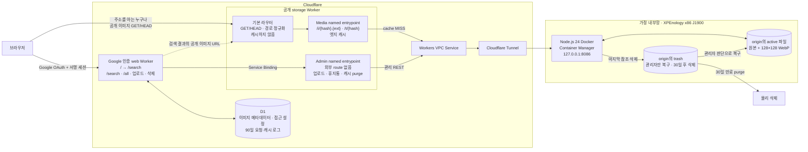
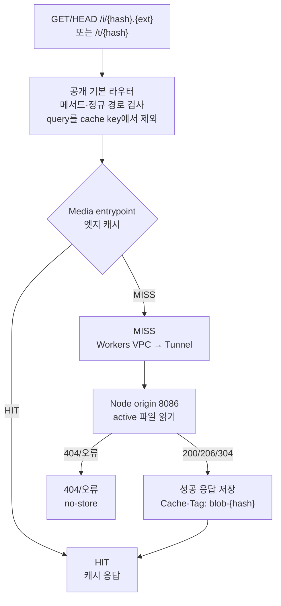
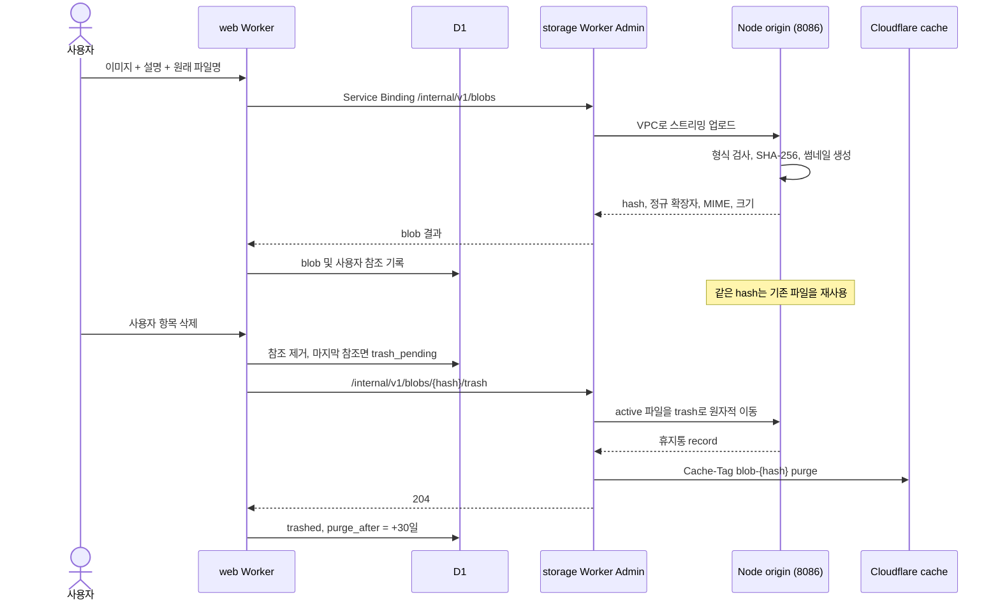
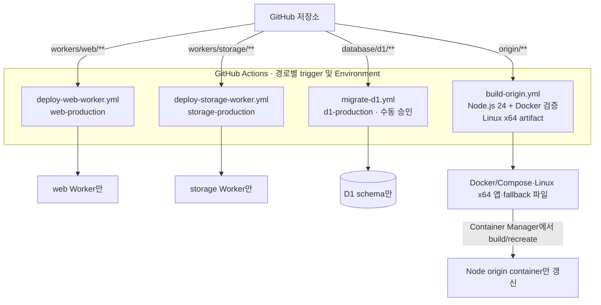

# 서비스 및 장비 연결 구조

이 문서는 배포 단위와 네트워크 경계를 한눈에 확인하기 위한 운영용 개요입니다. 실제
계정 ID, 도메인, 데이터베이스 ID, 토큰은 저장소에 기록하지 않습니다.

## 전체 구조

`web Worker`는 Google OpenID Connect 로그인을 요구합니다. 환경 변수에는 관리자
이메일 하나만 두고, 일반 Google 회원의 로그인 허용 여부는 D1 설정으로 관리합니다.
일반 회원에게는 관리자와 통계 경로를 노출하지 않으며 직접 접근도 404입니다.
삭제, 회원 접근 설정과 요청 통계 조회는 관리자에게만 허용합니다.
업로드 메타데이터는 Google `sub`별로 분리하며 `/all`과 `/search`는 현재 사용자의
항목만 조회합니다. 파일 해시 URL을 직접 알고 있을 때의 이미지 제공은 유지합니다.

반대로 `storage Worker`의 기본 라우트는 공개입니다. `/i/{sha256}.{ext}`와
`/t/{sha256}` 주소를 아는 사용자는 인증 없이 파일을 읽을 수 있습니다. origin 관리
API는 외부에 노출하지 않고 `web Worker`에서 `Admin` named entrypoint로만
호출하며, 그 작업을 시작하는 web Worker의 업로드·삭제 API에는 Google 인증이
적용됩니다.

Node.js origin은 8086을 사용합니다. storage Worker의 `VPC_SERVICE_ID`와
`ORIGIN_BASE_URL`은 이 origin을 가리킵니다.

## 이미지 조회와 엣지 캐시

캐시 HIT이면 VPC, Tunnel, Linux 장비로 트래픽이 발생하지 않습니다. 정상 응답만
해시 기반 키로 장기 엣지 캐시하고 404와 장애 응답은 저장하지 않습니다. 원본과
썸네일에는 같은 `blob-{sha256}` 캐시 태그를 사용합니다. 공개 storage gateway는
각 요청의 `Cf-Cache-Status`, hash, 유형, 응답 상태와 POP을 D1에 비동기로 기록합니다.

## 업로드와 삭제

휴지통으로 이동한 파일은 사용자에게 복구할 수 없는 상태입니다. 공개 URL도 캐시
purge 뒤 404가 됩니다. origin 이동과 전역 캐시 purge 사이의 짧은 비원자적 간격은
허용하며, 실패한 정리는 멱등 작업으로 재시도합니다. 30일 안의 복구 여부는 장비
관리자만 결정합니다.

## 단일 저장소의 격리된 배포

각 Worker는 독립된 `package.json`, lockfile, 임시 Wrangler 설정 생성기와 workflow를 가집니다.
web 배포는 storage Worker나 Linux 파일을 변경하지 않고, storage 배포도 web Worker,
D1 migration, Linux 파일을 변경하지 않습니다. origin workflow는 artifact만
만들며 서버를 변경하지 않습니다.

Wrangler의 실제 설정은 Actions 실행 중 임시 생성 후 제거합니다. Cloudflare API
토큰과 origin 관리 토큰은 대상별 GitHub Environment secret 또는 Cloudflare
encrypted secret에 두고, 계정·D1·VPC Service ID와 Worker 이름은 대상별 GitHub
Environment variable에 둡니다. Custom Domain, Workers VPC용 Tunnel과 VPC
Service는 Cloudflare 대시보드에서 관리하며 저장소와 배포 workflow에는 실제 값을
커밋하지 않습니다.
