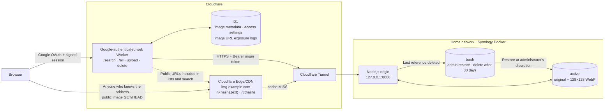
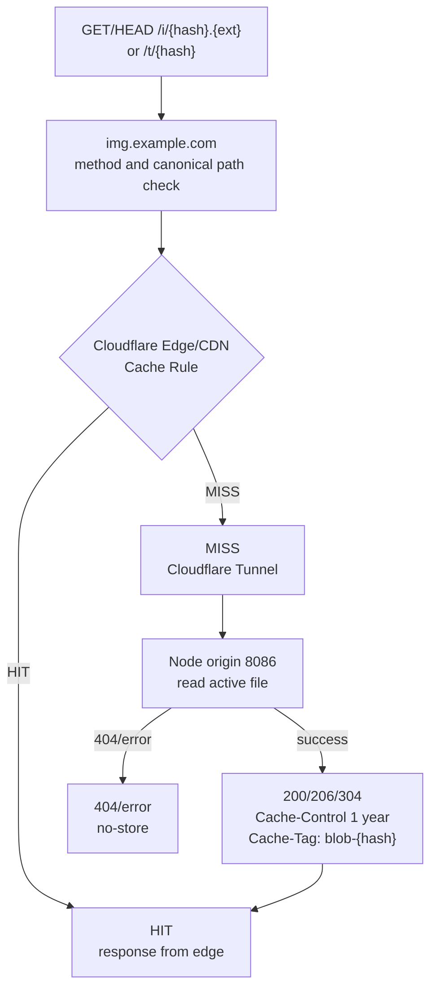
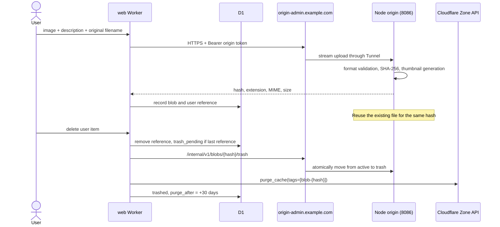
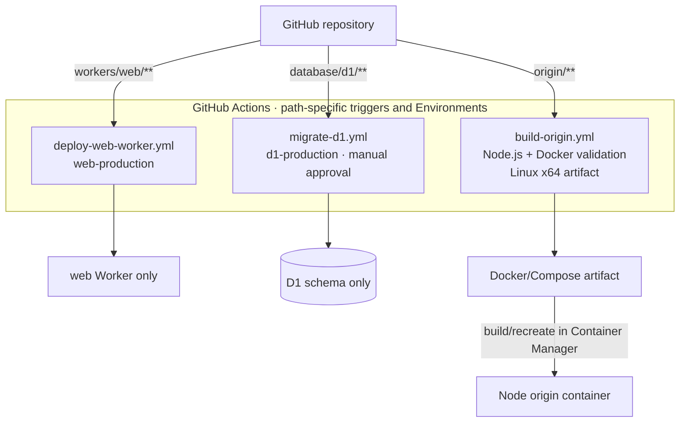

# Service and equipment connectivity architecture

[한국어](architecture.KO.md) | **English**

The current configuration separates public image paths from administrative paths. Public images are delivered directly to the Node origin through Cloudflare CDN and Tunnel, without a separate image Worker. Actual account IDs, domains, database IDs, and tokens are not recorded in the repository.

## Presentation overview

## Overall architecture

The `web Worker` requires Google OpenID Connect login. Access is controlled by one administrator email and the member-access setting in D1, while administrative paths and exposure logs are visible only to the administrator. `/all` and `/search` query only the current user's items, and public image GET/HEAD requests from users who know the hash URL are handled by `img.example.com`.

`img.example.com` exposes only image paths and caches successful responses for one year through a Cache Rule. `origin-admin.example.com` is a public administrative hostname, but mutation requests require the origin Bearer token. Only the web Worker holds and sends this token for administrative requests, and both hosts reach the internal Node.js origin through the same Tunnel connector.

## Image retrieval and edge cache

When the cache is a HIT, no request reaches the Tunnel or Synology. Public image responses return `Cache-Control: public, max-age=31536000, immutable` and `Cache-Tag: blob-{sha256}`, while 404 and failure responses are not stored. Because the web Worker does not see image GET requests, it cannot record HIT/MISS, POP, or whether the image was actually received in D1.

Instead, when the web Worker includes an image URL in an `/all` or `/api/search` response, it records the timestamp, filename, byte size, screen (`all`/`search`), and viewer sub in `image_url_exposure_logs` on a best-effort basis. This record does not mean that the image was actually downloaded or that browser or Cloudflare cache was used.

## Upload and deletion

When the last reference is deleted, processing occurs in the order of moving the origin file, purging the Zone cache tag, and finalizing the D1 state. The short interval between the origin move and global purge is allowed; failed cleanup remains `trash_pending` so cron can retry it idempotently. Browser-local caches cannot be cleared by Cloudflare purge, so a screen that was already visited may retain a one-year cache.

## Isolated deployment from a single repository

The web Worker, D1 migration, and origin build each have an independent workflow and do not change one another's deployment targets. The public image hostname, Tunnel, and Cache Rule are operated in the Cloudflare dashboard; there is no separate storage Worker or Workers VPC deployment. The origin workflow only creates an artifact and does not change the server.

Wrangler's actual configuration is generated temporarily during the Actions run and removed afterward. The Cloudflare API token, origin administration token, and cache purge token are stored as GitHub Environment secrets, while the account, D1, host, and Worker names are Environment variables. Actual values are not committed to the repository or deployment workflows.
